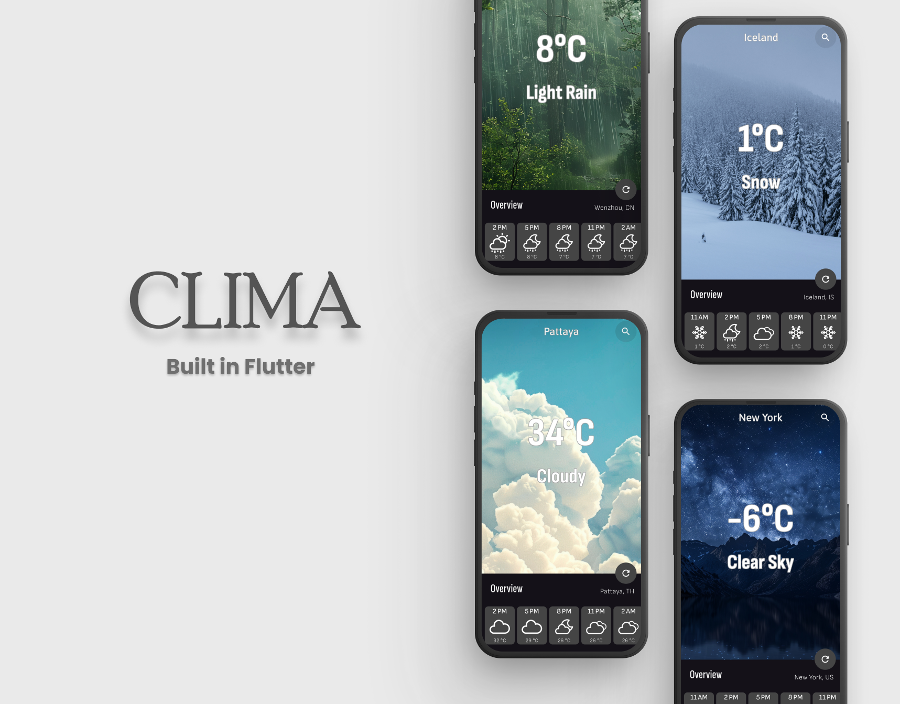

  

<h1 align="center">Clima</h1>

A sleek and modern weather app built with Flutter, providing accurate and real-time weather updates for any location.
 

## 🌍 Overview

Clima is a Flutter-based weather application that provides real-time weather updates for any location worldwide. It utilizes the OpenWeatherMap API to fetch current weather data, including temperature, humidity, and forecast details.
 

## ✨ Features

- 🌦️ **Real-time Weather Updates** – Get the latest weather conditions for any location.
- 📍 **Location-based Weather** – Automatically detects your location for instant weather updates.
- 🔍 **City Search** – Search for weather information by entering a city name.
- 🌤️ **Custom Weather Icons** – Displays weather conditions with custom icons.
- 🎨 **Dynamic Backgrounds** – Changes background based on weather conditions.

 

## 📱 App Preview

